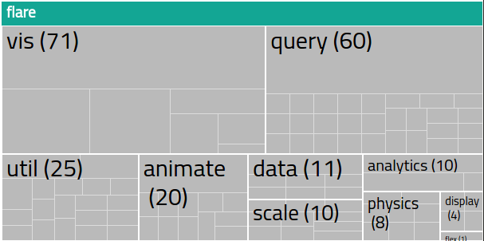

# zoomable-treemap


## Introduction
Zoomable Treemap is a javascript library to visualise and discover hierarchical data. Treemaps are a form of visualization where the area of each rectangle is proportional to its value. Originally developed by [Mike Bostock](http://bost.ocks.org/mike/) the [treemap](http://bost.ocks.org/mike/treemap/) uses [D3.js](http://d3js.org/).
This version extends the original library allowing to use the treemap as a navigation device for web and mobile users. This version of the treemap has been designed for the Italian Open Data catalogue - [dati.gov.it](http://www.dati.gov.it).

## Installation

To install the treemap on your website open the terminal and type the following commands:
```
cd <path to your local web server>

git clone https://github.com/insideout10/zoomable-treemap.git
```
You can now open `localhost/zoomable-treemap/` in your browser.



## Use it in your website

The data visualized come from the classic [flare.json](https://gist.github.com/mbostock/1093025#file-flare-json), but you can give the treemap any JSON organized in this way:

```
{
 "name": "flare",
 "children": [
  {
   "name": "analytics",
   "children": [
    {
     "name": "cluster",
     "children": [
      {"name": "AgglomerativeCluster", "size": 3938},
      {"name": "CommunityStructure", "size": 3812},
      {"name": "HierarchicalCluster", "size": 6714}
      ...
```
You can provide a color and Url to a node in the tree with an `info` object:

```
{
   "name": "analytics",
   "info":{
    "Url": "http://...",
    "color": "#3d5"
   },
   ...

```

To insert the treemap in a HTML page, load `jquery.js`, `d3.js` and `treemap.js` code, then build a div with attributes `id="treemap-container"` and `data-file="<json file address>"`. Below we report the `index.html` you can find in this repo, with useful comments.

```
<!DOCTYPE html>
<html>
    <head>
        <title>dati.gov.it - Zoomable treemap</title>
        <meta charset="UTF-8">
        <meta name="viewport" content="width=device-width, initial-scale=1.0">
        
        <link href='http://fonts.googleapis.com/css?family=Titillium+Web' rel='stylesheet' type='text/css'>
        
        <link rel="stylesheet" href="treemap.css">
    </head>
    <body>
        
        <!-- Insert div for the treemap -->
        <div id="treemap-container" data-file="flare.json"></div>
        
        <!-- Insert necessary Javascript code -->
        <script src="js/d3.min.js"></script>
        <script src="js/jquery.min.js"></script>
        <script src="js/treemap.js"></script>
    </body>
</html>
```
## License

This software is released under [BSD license](http://opensource.org/licenses/BSD-3-Clause). Copyright (c) 2010-2015, Michael Bostock. All rights reserved.
